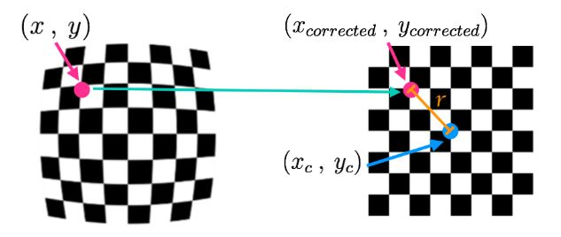
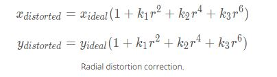
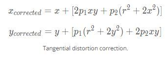

## Writeup Template

### You can use this file as a template for your writeup if you want to submit it as a markdown file, but feel free to use some other method and submit a pdf if you prefer.

---

**Advanced Lane Finding Project**

The goals / steps of this project are the following:

* Compute the camera calibration matrix and distortion coefficients given a set of chessboard images.
* Apply a distortion correction to raw images.
* Use color transforms, gradients, etc., to create a thresholded binary image.
* Apply a perspective transform to rectify binary image ("birds-eye view").
* Detect lane pixels and fit to find the lane boundary.
* Determine the curvature of the lane and vehicle position with respect to center.
* Warp the detected lane boundaries back onto the original image.
* Output visual display of the lane boundaries and numerical estimation of lane curvature and vehicle position.

[//]: # (Image References)

[image1]: ./examples/undistort_output.png "Undistorted"
[image2]: ./test_images/test1.jpg "Road Transformed"
[image3]: ./examples/binary_combo_example.jpg "Binary Example"
[image4]: ./examples/warped_straight_lines.jpg "Warp Example"
[image5]: ./examples/color_fit_lines.jpg "Fit Visual"
[image6]: ./examples/example_output.jpg "Output"
[combined_thresh_warp]: ./output_images/combined_thresh_warped_hist.JPG
[undistort_warp]: ./output_images/undistorted_warped.JPG
[rad_distort_eqn]: ./output_images/radial_distort_formula.JPG
[tan_distort_eqn]: ./output_images/tan_distort_formula.jpg "Output"
[highlighted_lane]: ./output_images/highlighted_lane.JPG 
[all_combined_thresh]: ./output_images/all_combined_thresh.jpg "After Applying Color and Gradient Thresholds" 
[all_combined_thresh_warp]: ./output_images/all_combined_thresh.JPG 
[combined_thresh_warped_hist]: ./output_images/combined_thresh_warped_hist.JPG 


[final_output_video]: ./output_images/CurvatureDisplay_output_video_solution.mp4  "Video"

## [Rubric](https://review.udacity.com/#!/rubrics/571/view) Points

### Here I will consider the rubric points individually and describe how I addressed each point in my implementation.  

---

### Writeup / README

#### 1. Provide a Writeup / README that includes all the rubric points and how you addressed each one.  You can submit your writeup as markdown or pdf.  [Here](https://github.com/udacity/CarND-Advanced-Lane-Lines/blob/master/writeup_template.md) is a template writeup for this project you can use as a guide and a starting point.  

You're reading it!

### Camera Calibration

#### 1. Briefly state how you computed the camera matrix and distortion coefficients. Provide an example of a distortion corrected calibration image.

The code for this step is contained in the first code cell of the IPython notebook located in "./examples/example.ipynb" (or in lines # through # of the file called `some_file.py`).  

Simply put, distortion correction translates 3d objects in the real world space. I start by preparing "object points", which will be the (x, y, z) coordinates of the chessboard corners in the world. Here I am assuming the chessboard is fixed on the (x, y) plane at z=0, such that the object points are the same for each calibration image.  Thus, `objp` is just a replicated array of coordinates, and `objpoints` will be appended with a copy of it every time I successfully detect all chessboard corners in a test image.  `imgpoints` will be appended with the (x, y) pixel position of each of the corners in the image plane with each successful chessboard detection.  

<p align="center">
  
</p>

I then used the output `objpoints` and `imgpoints` to compute the camera calibration and distortion coefficients using the `cv2.calibrateCamera()` function.  The distorition coefficients reflect the radial or tangential distortion relative to the image center for various angled lenses. They will be plugged into the correction formula to translate a real-world coordiate to its respective location on the corrected image plane. I applied this distortion correction to the test image using the `cv2.undistort()` function and obtained this result: 

<p align="center">
  
</p>

<p align="center">
  
</p>

![alt text][undistort_warp]

### Pipeline (single images)

#### 1. Provide an example of a distortion-corrected image.

To demonstrate this step, I will describe how I apply the distortion correction to one of the test images like the one seen below. 
![alt text][image2]

#### 2. Describe how (and identify where in your code) you used color transforms, gradients or other methods to create a thresholded binary image.  Provide an example of a binary image result.

I used a combination of color and gradient thresholds to generate a binary image (thresholding steps at lines # through # in `another_file.py`).  After a series of trial and errors, I picked only a subset of the thresholds, namely gradient, directional, and a S_channel range from the HLS colorspace to process the image as applying all thresholds had filtered out too few pixels for certain test images. 

The gradient threshold represents changes in the color intensity. Assuming the lanes generally contrast from the pavement on both sides, it was more advantageous to look at the gradient along the horizontal axis. Directional threshold 

Here's an example of my output for this step.  (note: this is not actually from one of the test images)

![all_combined_thresh][all_combined_thresh]

#### 3. Describe how (and identify where in your code) you performed a perspective transform and provide an example of a transformed image.

The code for my perspective transform includes a function called `warp()`, which appears in lines 1 through 8 in the file `example.py` (output_images/examples/example.py) (or, for example, in the 3rd code cell of the IPython notebook).  The `warp()` function takes as inputs an image (`img`), as well as source (`src`) and destination (`dst`) points.  I started by eye-balling the the source and destination points based on a plotted test image. 

```python
  src_coordinates = np.float32(
    [[280,  700],  # Bottom left
     [595,  460],  # Top left
     [725,  460],  # Top right
     [1125, 700]]) # Bottom right

    dst_coordinates = np.float32(
    [[250,  720],  # Bottom left
     [250,    0],  # Top left
     [1065,   0],  # Top right
     [1065, 720]]) # Bottom right  
```

This resulted in the following source and destination points:

| Source        | Destination   | 
|:-------------:|:-------------:| 
| 585, 460      | 320, 0        | 
| 203, 720      | 320, 720      |
| 1127, 720     | 960, 720      |
| 695, 460      | 960, 0        |


#### 4. Describe how (and identify where in your code) you identified lane-line pixels and fit their positions with a polynomial?

Then I did some other stuff and fit my lane lines with a 2nd order polynomial kinda like this:

<p align="center">
  
</p>


#### 5. Describe how (and identify where in your code) you calculated the radius of curvature of the lane and the position of the vehicle with respect to center.

I did this in lines # through # in my code in `my_other_file.py`

#### 6. Provide an example image of your result plotted back down onto the road such that the lane area is identified clearly.

I implemented this step in lines # through # in my code in `yet_another_file.py` in the function `map_lane()`.  Here is an example of my result on a test image:

![alt text][highlighted_lane]

---

### Pipeline (video)

#### 1. Provide a link to your final video output.  Your pipeline should perform reasonably well on the entire project video (wobbly lines are ok but no catastrophic failures that would cause the car to drive off the road!).

Here's a [link to my video result](./output_images/CurvatureDisplay_output_video_solution.mp4 )

---

### Discussion

#### 1. Briefly discuss any problems / issues you faced in your implementation of this project.  Where will your pipeline likely fail?  What could you do to make it more robust?

1. There are portions of the code that should be more dynamic. 
  a. source and destination points: Instead of hard cording the coordinates, 
  b. 
  
2. More efficient lane pixel search could have been implemented: Instead of performing a search and/or transformation on the full scope of the image, a class Line could be implented to store. Each line object may contain crtical parameters such as the left_fitx and right_fitx points. This will allow for a more targeted search in the next frame by only detecting activated pixels +/- a certain margin from the previous set of extrapolated points. 

These obstacles become quite evident when running the challenge video through the pipeline. 
